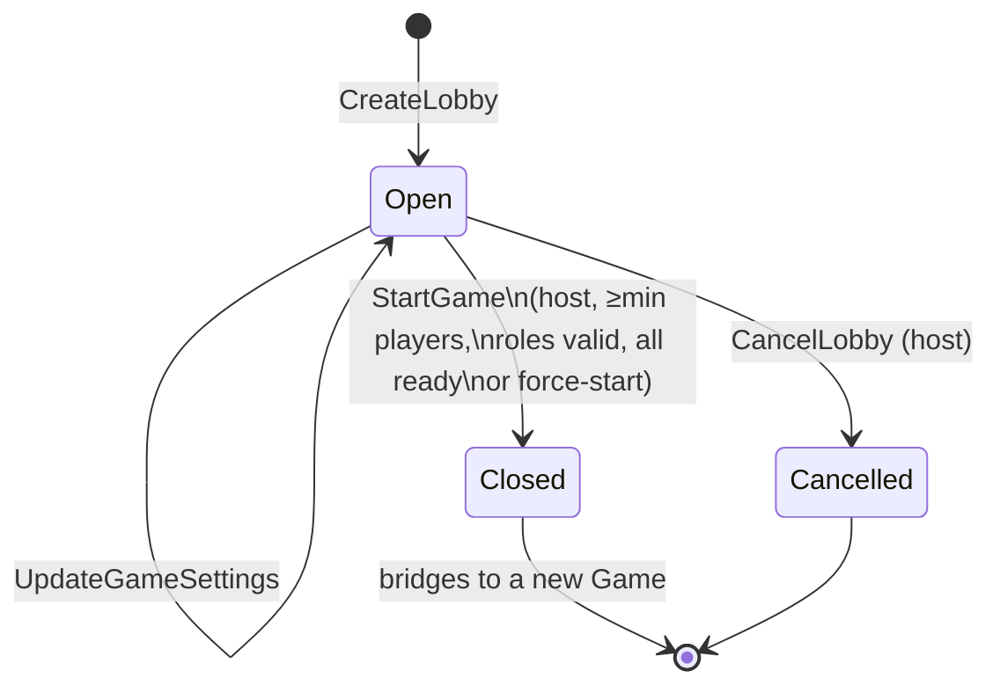
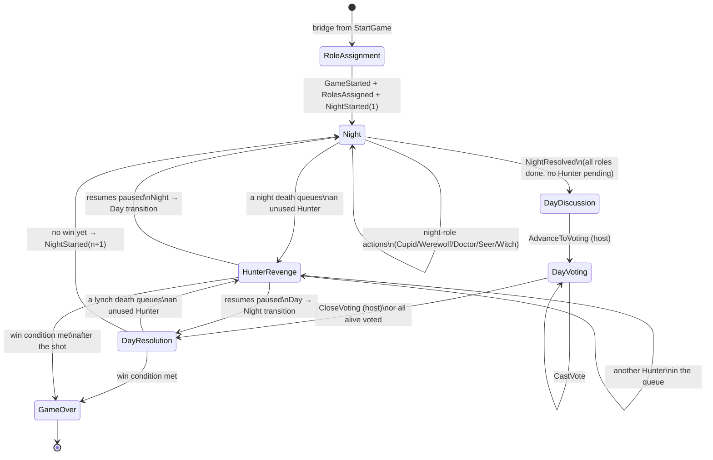
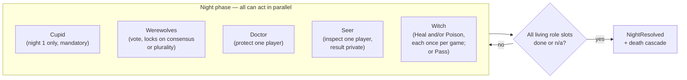

# Werewolf — Game Flow & Frontend Integration Guide

This doc is for implementing the client: the full Lobby + Game state machine as Mermaid diagrams,
every HTTP endpoint the FE can call, and the SignalR notifications it should listen for.

**Current backend status (read this first):** every endpoint below validates against current state
and appends its event — that part is fully wired and safe to build against. The *automatic* parts of
the flow (night auto-resolving once all roles have acted, day voting auto-closing once everyone's
voted, hunter-revenge auto-resuming the paused phase, win-condition checks) are now wired — see §0.1
for how.

---

## 0. Gaps vs. the design doc (`make-a-plan-werewolf-calm-hippo.md`)

Comparing the current code against the original plan turned up a design deviation the FE should know
about, plus two real gaps.

### 0.1 The cascade is wired via an async projection side effect, not same-transaction

The plan's core design principle (§0) was: *"each command handler recomputes a completeness predicate
over the folded aggregate state and, if satisfied, appends the phase-advance event(s) in the same
transaction."* The orchestration logic (`NightChecklist`, `DeathResolver`, `WinConditionEvaluator`,
`GameCommandSupport.TryResolveNight` / `CloseVotingAndResolve` / `TryResumeAfterHunterResolution`)
still exists, but two different wiring strategies are actually used depending on who causes the
transition:

- **Same transaction** — when the acting player's own command directly causes the next state:
  `CloseVoting` (explicit host action) calls `GameCommandSupport.CloseVotingAndResolve` inline;
  `SubmitHunterRevengeShot`/`PassHunterRevenge` resolve the shot's death cascade and resume the
  paused phase inline via `GameCommandSupport.ResolveHunterRevengeShot` / `DeclineHunterRevenge`.
- **Async, via a projection side effect** — when a system-wide condition is completed by whichever
  of several independent actors happens to go last (a night role finishing the checklist, the last
  alive player voting): `GameFlowTriggerProjection` (`Werewolf/Game/GameFlowTriggerProjection.cs`)
  watches the Game event stream and publishes an internal `TryResolveNight` / `TryCloseVoting`
  message (via Marten's `RaiseSideEffects`/`PublishMessage`, atomic with the projection's own
  commit); `GameFlowTriggerHandler` re-checks the completeness predicate against freshly-loaded
  state and appends the cascade if it still holds. This means those two transitions land a moment
  after the triggering request returns (same async-daemon-catch-up caveat as the read-model
  projections below) rather than in the same HTTP response — poll or wait for the SignalR
  notification rather than assuming the state is fully advanced immediately after, say, the last
  `SubmitSeerInspection` call returns.

Win conditions are evaluated as part of both paths (`TryResumeAfterHunterResolution`), so `GameEnded`
now fires automatically whenever a death round settles a win.

### 0.2 No optimistic-concurrency `Version` on commands

Plan §C.4: *"each command carrying RoomCode + actor id + Version (for optimistic concurrency)."* None
of the current command DTOs (§7 below) have a `version` field, so there's no client-side conflict
detection if two players race on the same aggregate (e.g. two Doctors somehow, or a vote landing on a
stale phase). Not blocking for a first FE pass, but don't assume last-write-wins is safe long-term.

### 0.3 No read/query (`GET`) endpoints exist yet

Every endpoint in this codebase is a `POST` command — there is currently **no HTTP way to fetch**
`RoomLobbyView`, `PlayerGameView`, or `GameLogView`. SignalR gives you push notifications, but nothing
gives the FE an initial snapshot on load or reconnect. You'll need to either add `GET` endpoints
against these read models yourself, or have the FE reconstruct state purely from the SignalR event
stream (works, but loses state on refresh/reconnect unless you replay history). The DTO shapes for
these three read models are in §7.4 so you know what to expose once the `GET` endpoints exist.

---

## 1. Lobby state machine



- The **host** is whichever player created the lobby, or whoever inherits it via `HostTransferred`
  if the host leaves (`LeaveLobby` picks the next player deterministically).
- `Closed`/`Cancelled` are terminal for the Lobby — every command after that is rejected.
- `StartGame` is the bridge: it closes the Lobby stream *and* atomically starts a brand-new Game
  stream (role assignment + first night) in one transaction.

---

## 2. Game phase state machine



- `HunterRevenge` isn't tracked as a `GamePhase` value in the backend — it's an orthogonal guard
  (`PendingHunterRevenge` queue non-empty) that blocks the next phase transition regardless of
  whether it interrupted `Night` or `DayResolution`. The diagram shows it as a state for clarity on
  the FE side (e.g. "show the revenge-shot modal") but `GET` state will report the *underlying* phase
  (`Night` or `DayResolution`) with a non-empty pending-revenge list.
- `GameOver` is terminal — every command after that is rejected.

### Win conditions (checked whenever a death round fully settles)

| Winner | Condition |
|---|---|
| Lovers | overrides both below — the two paired lovers are the last two players alive |
| Villagers | no werewolves remain alive |
| Werewolves | alive werewolves ≥ alive non-werewolves |

---

## 3. Night sub-phase checklist

Night is **one** phase, not a linear sequence — each role acts independently and in any order. The
FE should render all five role slots as independently-completable, not as a wizard/stepper:



A role "slot" counts as done if: no living holder exists, the ability is already exhausted, or an
action/explicit-pass was recorded this night. The Witch's heal is guarded — `UseWitchHealPotion` is
rejected until the werewolves' target is locked.

---

## 4. HTTP API reference

All request bodies are JSON. `RoomCode` serializes as a plain string (e.g. `"PQXR7K"`), not a nested
object. All Game/Lobby endpoints validate against current aggregate state and return **400
`application/problem+json`** with a `title` describing the failure (e.g. `"Doctor cannot protect
themselves."`) when a guard fails.

### Lobby

| Method & Route | Body | Notes |
|---|---|---|
| `POST /api/v1/lobby` | `{ hostPlayerId, hostDisplayName }` | Returns `{ roomCode }`. Host auto-joins, ready. |
| `POST /api/v1/lobby/join` | `{ roomCode, playerId, displayName }` | No-op if already joined. |
| `POST /api/v1/lobby/leave` | `{ roomCode, playerId }` | Transfers host if the host leaves. |
| `POST /api/v1/lobby/kick` | `{ roomCode, requestedBy, playerId }` | Host only; can't kick self. |
| `POST /api/v1/lobby/ready` | `{ roomCode, playerId, isReady }` | Toggle ready state. |
| `POST /api/v1/lobby/roles` | `{ roomCode, requestedBy, distribution: { <Role>: count } }` | Host only. |
| `POST /api/v1/lobby/settings` | `{ roomCode, requestedBy, settings: {...GameSettings} }` | Host only. |
| `POST /api/v1/lobby/cancel` | `{ roomCode, requestedBy }` | Host only; terminal. |
| `POST /api/v1/lobby/start` | `{ roomCode, requestedBy, forceStart }` | Host only. Returns `{ gameId, roomCode }`. Bridges to Game. |

`Role` enum: `Villager, Werewolf, Seer, Doctor, Hunter, Witch, Cupid`.

`GameSettings` shape:
```json
{
  "revealRoleOnDeath": true,
  "doctorCanSelfProtect": false,
  "werewolfRequiresConsensus": true,
  "witchSinglePotionPerNight": true,
  "minPlayers": 5,
  "allowForceStart": false
}
```

### Game — night

| Method & Route | Body | Guard |
|---|---|---|
| `POST /api/v1/game/cupid` | `{ roomCode, playerId, firstPlayerId, secondPlayerId }` | Night 1 only; alive Cupid; not yet paired. |
| `POST /api/v1/game/werewolf/vote` | `{ roomCode, playerId, targetPlayerId }` | Alive Werewolf; target alive & non-wolf. |
| `POST /api/v1/game/doctor/protect` | `{ roomCode, playerId, targetPlayerId }` | Alive Doctor; not yet acted; self-protect only if setting allows. |
| `POST /api/v1/game/seer/inspect` | `{ roomCode, playerId, targetPlayerId }` | Alive Seer; not yet acted; target ≠ self. |
| `POST /api/v1/game/witch/heal` | `{ roomCode, playerId }` | Alive Witch; heal potion unused; wolves' target locked. |
| `POST /api/v1/game/witch/poison` | `{ roomCode, playerId, targetPlayerId }` | Alive Witch; poison potion unused; target alive. |
| `POST /api/v1/game/witch/pass` | `{ roomCode, playerId }` | Alive Witch; not yet acted. |
| `POST /api/v1/game/hunter/shoot` | `{ roomCode, playerId, targetPlayerId }` | Player is head of the pending-revenge queue; target alive. |
| `POST /api/v1/game/hunter/pass` | `{ roomCode, playerId }` | Player is head of the pending-revenge queue. |

### Game — day

| Method & Route | Body | Guard |
|---|---|---|
| `POST /api/v1/game/voting/advance` | `{ roomCode, requestedBy }` | Host; phase = `DayDiscussion`. |
| `POST /api/v1/game/vote` | `{ roomCode, voterPlayerId, targetPlayerId? }` | Alive voter; `targetPlayerId` omitted = abstain. |
| `POST /api/v1/game/voting/close` | `{ roomCode, requestedBy }` | Host; phase = `DayVoting`. |

---

## 5. Real-time notifications (SignalR)

Hub URL: **`/hubs/werewolf`**.

On connect, send a `JoinGameRoom` message over the hub connection to subscribe:

```json
{ "roomCode": "PQXR7K", "playerId": "…optional, your own player id…" }
```

Send `LeaveGameRoom` (same shape) to unsubscribe. Two group scopes exist server-side:

- **`room:{roomCode}`** — broadcasts everyone in the room receives: phase changes, deaths, game end.
- **`room:{roomCode}:player:{playerId}`** — private to one player: e.g. a Seer's own inspection
  result. Only sent if you included `playerId` when joining.

Notification `kind` values currently wired (see `Werewolf/Notifications/PlayerNotification.cs`):

| `kind` | Scope | Payload |
|---|---|---|
| `game.started` | broadcast | `{ gameId }` |
| `night.started` | broadcast | `{ nightNumber }` |
| `day.started` | broadcast | `{ dayNumber }` |
| `voting.started` | broadcast | `{}` |
| `player.died` | broadcast | `{ playerId, cause, role? }` — `role` only if `revealRoleOnDeath` |
| `player.lynched` | broadcast | `{ playerId, role? }` |
| `seer.result` | private (Seer) | `{ targetPlayerId, observedRole }` |
| `game.ended` | broadcast | `{ winningFaction, roles: { playerId: role } }` |

`cause` for `player.died` is one of: `"night"`, `"lynch"`, `"lover-link"`, `"hunter-revenge"`.

---

## 6. Suggested FE screen → phase mapping

| Screen | Backing phase / state |
|---|---|
| Lobby / waiting room | `LobbyStatus.Open` |
| Role reveal (self only, never broadcast) | on `game.started`, fetch your own `PlayerGameView` |
| Night actions (role-conditional UI) | `GamePhase.Night` — show only the action(s) for the viewing player's own role |
| Day discussion (chat/timer, no protocol here) | `GamePhase.DayDiscussion` |
| Voting | `GamePhase.DayVoting` |
| Hunter revenge modal (interrupts either Night or Day) | `PendingHunterRevenge` non-empty **and** it's this player's turn (head of queue) |
| Game over / role reveal | `GamePhase.GameOver`, use `game.ended` payload for full role reveal |

---

## 7. DTOs (exact request/response shapes)

`RoomCode` is a plain JSON string everywhere (custom converter — never `{ "value": "..." }`). Enums
serialize as PascalCase strings (`"Werewolf"`, not `1`). All `Guid` fields are standard UUID strings.

### 7.1 Lobby requests

```ts
// POST /api/v1/lobby
type CreateLobbyRequest = { hostPlayerId: string; hostDisplayName: string };
type CreateLobbyResponse = { roomCode: string };

// POST /api/v1/lobby/join
type JoinLobbyRequest = { roomCode: string; playerId: string; displayName: string };
// 200, no body

// POST /api/v1/lobby/leave
type LeaveLobbyRequest = { roomCode: string; playerId: string };
// 200, no body

// POST /api/v1/lobby/kick
type KickPlayerRequest = { roomCode: string; requestedBy: string; playerId: string };
// 200, no body

// POST /api/v1/lobby/ready
type SetReadyRequest = { roomCode: string; playerId: string; isReady: boolean };
// 200, no body

// POST /api/v1/lobby/roles
type UpdateRoleDistributionRequest = {
  roomCode: string;
  requestedBy: string;
  distribution: Partial<Record<Role, number>>; // e.g. { "Werewolf": 2, "Seer": 1 }
};
// 200, no body

// POST /api/v1/lobby/settings
type UpdateGameSettingsRequest = { roomCode: string; requestedBy: string; settings: GameSettings };
// 200, no body

// POST /api/v1/lobby/cancel
type CancelLobbyRequest = { roomCode: string; requestedBy: string };
// 200, no body

// POST /api/v1/lobby/start
type StartGameRequest = { roomCode: string; requestedBy: string; forceStart: boolean };
type StartGameResponse = { gameId: string; roomCode: string };

type Role = "Villager" | "Werewolf" | "Seer" | "Doctor" | "Hunter" | "Witch" | "Cupid";

type GameSettings = {
  revealRoleOnDeath: boolean;
  doctorCanSelfProtect: boolean;
  werewolfRequiresConsensus: boolean;
  witchSinglePotionPerNight: boolean;
  minPlayers: number;
  allowForceStart: boolean;
};
```

### 7.2 Game requests (night)

```ts
// POST /api/v1/game/cupid
type SubmitCupidPairingRequest = {
  roomCode: string; playerId: string; firstPlayerId: string; secondPlayerId: string;
};

// POST /api/v1/game/werewolf/vote
type SubmitWerewolfVoteRequest = { roomCode: string; playerId: string; targetPlayerId: string };

// POST /api/v1/game/doctor/protect
type SubmitDoctorProtectionRequest = { roomCode: string; playerId: string; targetPlayerId: string };

// POST /api/v1/game/seer/inspect
type SubmitSeerInspectionRequest = { roomCode: string; playerId: string; targetPlayerId: string };

// POST /api/v1/game/witch/heal
type UseWitchHealPotionRequest = { roomCode: string; playerId: string };

// POST /api/v1/game/witch/poison
type UseWitchPoisonPotionRequest = { roomCode: string; playerId: string; targetPlayerId: string };

// POST /api/v1/game/witch/pass
type PassWitchRequest = { roomCode: string; playerId: string };

// POST /api/v1/game/hunter/shoot
type SubmitHunterRevengeShotRequest = { roomCode: string; playerId: string; targetPlayerId: string };

// POST /api/v1/game/hunter/pass
type PassHunterRevengeRequest = { roomCode: string; playerId: string };
```

All of the above return **200 with no body** on success, or **400 `application/problem+json`**
(`{ title, status, ... }`) on a validation failure.

### 7.3 Game requests (day)

```ts
// POST /api/v1/game/voting/advance
type AdvanceToVotingRequest = { roomCode: string; requestedBy: string };

// POST /api/v1/game/vote
type CastVoteRequest = { roomCode: string; voterPlayerId: string; targetPlayerId?: string }; // omit = abstain

// POST /api/v1/game/voting/close
type CloseVotingRequest = { roomCode: string; requestedBy: string };
```

### 7.4 Read models (not yet exposed over HTTP — see §0.3)

These are the Marten projections that back the "one snapshot per screen" queries you'll want once
`GET` endpoints exist. Field names below are camelCase as they'd serialize over JSON.

```ts
// One per lobby — public, no secrets pre-game
type RoomLobbyView = {
  id: string;               // lobby's internal stream id
  roomCode: string;
  status: "Open" | "Closed" | "Cancelled"; // "Starting" also exists but is transient
  hostPlayerId: string;
  players: Record<string /* playerId */, {
    playerId: string;
    displayName: string;
    isReady: boolean;
  }>;
  roleDistribution: Partial<Record<Role, number>>;
  settings: GameSettings;
};

// One per (gameId, playerId) — role-scoped, this is what keeps secrets from leaking
type PlayerGameView = {
  id: string;                // "{gameId}:{playerId}", both N-format guids
  gameId: string;
  playerId: string;
  role: Role;                 // this player's OWN role only
  isAlive: boolean;
  phase: "RoleAssignment" | "Night" | "DayDiscussion" | "DayVoting" | "DayResolution" | "GameOver";
  nightNumber: number;
  dayNumber: number;
  lastSeerResult: string | null; // "{targetPlayerId}:{observedRole}" — only populated for the Seer
};

// One per game — public, spoiler-safe human-readable log
type GameLogView = {
  id: string;   // gameId
  entries: string[]; // e.g. "Night 1 started", "Player <id> died (night)"
};
```

> **Not yet in `PlayerGameView`, per §0.3 — you'll likely need to add these once wiring up a richer
> FE:** lover pairing (whether *this* player is paired and with whom), whether it's this player's turn
> in the Hunter-revenge queue, this player's own Witch potion-used flags, and the day vote tally /
> who's voted. Currently that state only exists in the write-side `GameState` (server-internal), not
> in any projection exposed to the FE.
