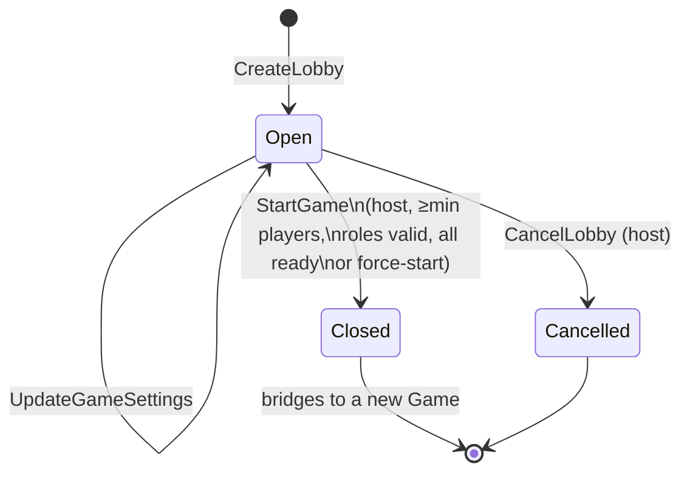
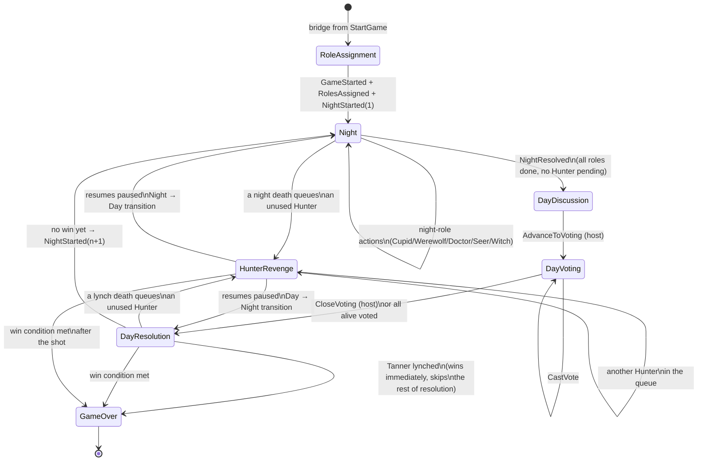
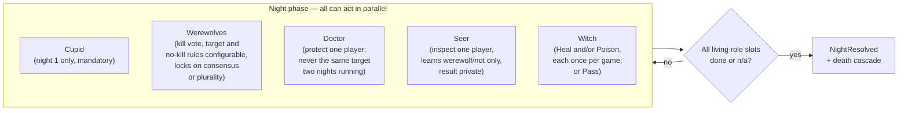

# Werewolf — Game Flow & Frontend Integration Guide

This doc is for implementing the client: the full Lobby + Game state machine as Mermaid diagrams,
every HTTP endpoint the FE can call in the order it should call them, screen-by-screen button
layouts, and the SignalR notifications to subscribe to.

**Current backend status (read this first):** every endpoint below validates against current state
and appends its event — that part is fully wired and safe to build against. The *automatic* parts of
the flow (night auto-resolving once all roles have acted, day voting auto-closing once everyone's
voted, hunter-revenge auto-resuming the paused phase, win-condition checks) are now wired — see §0.1
for how. `GET` read endpoints now exist (§4.3) — no need to reconstruct state purely from SignalR.

---

## 0. Gaps vs. the design doc (`make-a-plan-werewolf-calm-hippo.md`)

### 0.1 The cascade is wired via an async projection side effect, not same-transaction

The plan's core design principle (§0) was: *"each command handler recomputes a completeness predicate
over the folded aggregate state and, if satisfied, appends the phase-advance event(s) in the same
transaction."* The orchestration logic (`NightChecklist`, `DeathResolver`, `WinConditionEvaluator`,
`GameCommandSupport.TryResolveNight` / `CloseVotingAndResolve` / `TryResumeAfterHunterResolution`)
still exists, but two different wiring strategies are actually used depending on who causes the
transition:

- **Same transaction** — when the acting player's own command directly causes the next state:
  `CloseVoting` (explicit host action) calls `GameCommandSupport.CloseVotingAndResolve` inline;
  `SubmitHunterRevengeShot`/`PassHunterRevenge` resolve the shot's death cascade and resume the
  paused phase inline via `GameCommandSupport.ResolveHunterRevengeShot` / `DeclineHunterRevenge`.
- **Async, via a projection side effect** — when a system-wide condition is completed by whichever
  of several independent actors happens to go last (a night role finishing the checklist, the last
  alive player voting): `GameFlowTriggerProjection` (`Werewolf/Game/GameFlowTriggerProjection.cs`)
  watches the Game event stream and publishes an internal `TryResolveNight` / `TryCloseVoting`
  message (via Marten's `RaiseSideEffects`/`PublishMessage`, atomic with the projection's own
  commit); `GameFlowTriggerHandler` re-checks the completeness predicate against freshly-loaded
  state and appends the cascade if it still holds. This means those two transitions land a moment
  after the triggering request returns (same async-daemon-catch-up caveat as `GameLogView`/
  `PlayerDirectory`, both registered `Inline` so they don't have this lag) — poll `GET
  /api/v1/game/{roomCode}` or wait for the SignalR notification rather than assuming the state is
  fully advanced immediately after, say, the last `SubmitSeerInspection` call returns.

Win conditions are evaluated as part of both paths (`TryResumeAfterHunterResolution`), so `GameEnded`
now fires automatically whenever a death round settles a win.

### 0.2 No optimistic-concurrency `Version` on commands

Plan §C.4: *"each command carrying RoomCode + actor id + Version (for optimistic concurrency)."* None
of the current command DTOs (§4 below) have a `version` field, so there's no client-side conflict
detection if two players race on the same aggregate (e.g. two Doctors somehow, or a vote landing on a
stale phase). Not blocking for a first FE pass, but don't assume last-write-wins is safe long-term.

---

## 1. Lobby state machine



- The **host** is whichever player created the lobby, or whoever inherits it via `HostTransferred`
  if the host leaves (`LeaveLobby` picks the next player deterministically).
- `Closed`/`Cancelled` are terminal for the Lobby — every command after that is rejected.
- `StartGame` is the bridge: it closes the Lobby stream *and* atomically starts a brand-new Game
  stream (role assignment + first night) in one transaction.

---

## 2. Game phase state machine



- `HunterRevenge` isn't tracked as a `GamePhase` value in the backend — it's an orthogonal guard
  (`PendingHunterRevenge` queue non-empty) that blocks the next phase transition regardless of
  whether it interrupted `Night` or `DayResolution`. The diagram shows it as a state for clarity on
  the FE side (e.g. "show the revenge-shot modal") but `GET` state will report the *underlying* phase
  (`Night` or `DayResolution`) with a non-empty pending-revenge list.
- `GameOver` is terminal — every command after that is rejected.

### Win conditions (checked whenever a death round fully settles)

| Winner | Condition |
|---|---|
| Tanner | if the Tanner is lynched by the day vote, they win alone, immediately — this short-circuits before the lynch's usual lover-link/Hunter-revenge resolution even runs. Dying any other way (night kill, poison, lover-link) is just an ordinary death, no special win. |
| Lovers | overrides Villagers/Werewolves below — the two players Cupid paired on night 1 are the last two players alive, they win together regardless of original faction |
| Villagers | no werewolves remain alive |
| Werewolves | alive werewolves ≥ alive non-werewolves |

---

## 3. Night sub-phase checklist

Night is **one** phase, not a linear sequence — each role acts independently and in any order. The
FE should render all five role slots as independently-completable, not as a wizard/stepper:



A role "slot" counts as done if: no living holder exists, the ability is already exhausted, or an
action/explicit-pass was recorded this night. The Witch's heal is guarded — `UseWitchHealPotion` is
rejected until the werewolves' target is locked.

**Rules worth calling out explicitly for the FE (recently tightened):**
- **Seer** only learns *whether the target is a werewolf or not* (`isWerewolf: true/false`) — never
  the target's exact role. Don't build UI that implies a full role reveal.
- **Doctor** cannot protect the same player on two consecutive nights (a different target, or the
  same target again after a night's gap, is fine). Disable/gray out the previous night's target in
  the Doctor's target picker.
- **Werewolves**, by default, must vote for a kill every night and can never target a fellow
  werewolf — two new per-game settings relax either rule (see §4.1's `GameSettings`):
  `WerewolfCanVoteNoKill` (omit `targetPlayerId` to vote for no kill) and `WerewolfCanTargetWerewolf`
  (a werewolf becomes a selectable target for other werewolves — but a werewolf can never vote for
  *themselves*, regardless of settings). Build the wolf-vote picker off these two flags (read from
  `/api/v1/rules` or your own lobby settings state) rather than hardcoding the exclusions.
- **Werewolves see each other's votes live over plain HTTP, not SignalR**: `GET
  /api/v1/game/{roomCode}/werewolf/votes?playerId={callerId}` returns the current vote tally and lock
  state — but only if `callerId` is themselves a living werewolf (404 otherwise, not 403, so the
  response never confirms or denies pack membership to a non-wolf). Poll this endpoint to render an
  in-progress tally in the wolf-only panel; see §4.3 and §7 for why this is HTTP-pull instead of a
  push like every other role's private channel.
- **Night roles act in a fixed order, strictly enforced server-side**: Cupid (night 1 only) →
  Werewolves → Doctor → Seer → Witch. A role's endpoint rejects the call with 400 if it isn't yet
  that role's turn (e.g. the Doctor can't act before the Werewolves have locked a target) — see §4.2's
  guard column and §7's `night.narration`/`night.turn` pushes for how the client learns whose turn it
  is without any push ever naming a player by role.
- **Day votes are visible to everyone as they're cast**: a `vote.cast` broadcast fires for every
  `CastVote`, not just once voting closes — see §7. Render a live tally during Voting, not just the
  final result.

---

## 4. HTTP API reference

All request bodies are JSON. `RoomCode` serializes as a plain string (e.g. `"PQXR7K"`), not a nested
object. All Game/Lobby `POST` endpoints validate against current aggregate state and return **400
`application/problem+json`** with a `title` describing the failure (e.g. `"Doctor cannot protect the
same player two nights in a row."`) when a guard fails.

### 4.1 Lobby

| Method & Route | Body | Notes |
|---|---|---|
| `POST /api/v1/lobby` | `{ hostPlayerId, hostDisplayName }` | Returns `{ roomCode }`. Host auto-joins, ready. |
| `POST /api/v1/lobby/join` | `{ roomCode, playerId, displayName }` | No-op if already joined. |
| `POST /api/v1/lobby/leave` | `{ roomCode, playerId }` | Transfers host if the host leaves. |
| `POST /api/v1/lobby/kick` | `{ roomCode, requestedBy, playerId }` | Host only; can't kick self. |
| `POST /api/v1/lobby/ready` | `{ roomCode, playerId, isReady }` | Toggle ready state. |
| `POST /api/v1/lobby/roles` | `{ roomCode, requestedBy, distribution: { <Role>: count } }` | Host only. |
| `POST /api/v1/lobby/settings` | `{ roomCode, requestedBy, settings: {...GameSettings} }` | Host only. |
| `POST /api/v1/lobby/cancel` | `{ roomCode, requestedBy }` | Host only; terminal. |
| `POST /api/v1/lobby/start` | `{ roomCode, requestedBy, forceStart }` | Host only. Returns `{ gameId, roomCode }`. Bridges to Game. |
| `POST /api/v1/lobby/rematch` | `{ roomCode, requestedBy }` | Host only; lobby `Status` must be `Closed` (game already started/ended in this room). Reopens the lobby: `Status` becomes `Open` again, every non-host player's ready flag resets to `false` (host stays ready), role distribution and settings carry over unchanged. Emits `LobbyReopened` event, triggering the same `lobby.updated` SignalR notification as any other lobby mutation (clients resync via `GET /api/v1/lobby` if needed). Returns 200 with no body. The subsequent `POST /api/v1/lobby/start` call creates a brand-new `GameState` stream (fresh `gameId`) for round 2, so chat and game log start empty automatically (both keyed by `GameId`, not `RoomCode`). |

`Role` enum: `Villager, Werewolf, Seer, Doctor, Hunter, Witch, Cupid, Tanner`.

`GameSettings` shape:
```json
{
  "revealRoleOnDeath": true,
  "doctorCanSelfProtect": true,
  "werewolfRequiresConsensus": true,
  "werewolfCanTargetWerewolf": false,
  "werewolfCanVoteNoKill": false,
  "witchSinglePotionPerNight": false,
  "minPlayers": 5,
  "allowForceStart": false,
  "witchKnowsWerewolfTarget": true
}
```
`werewolfCanTargetWerewolf` (default `false`): if `true`, a werewolf may vote to kill a fellow living
werewolf (never themselves — that's blocked unconditionally). `werewolfCanVoteNoKill` (default
`false`): if `true`, a werewolf may omit `targetPlayerId` to vote for no kill instead of naming a
victim. `witchKnowsWerewolfTarget` (default `true`, the classic tabletop rule): if `true`, the Witch
can call `GET /api/v1/game/{roomCode}/witch/target` to learn who the werewolves locked onto before
deciding whether to heal/poison/pass; if `false`, that endpoint always returns a `null` target and she
must decide blind.

### 4.2 Game — commands

Night-role commands below are gated by a fixed turn order — Cupid (night 1 only) → Werewolves →
Doctor → Seer → Witch — in addition to each row's own guard. A role's endpoint returns 400 (`"It is
not this role's turn yet (current turn: X)."`) if called before every earlier step in that order has
finished, even if the caller's own role-specific preconditions (alive, hasn't acted yet, etc.) are
otherwise satisfied.

| Method & Route | Body | Guard |
|---|---|---|
| `POST /api/v1/game/cupid` | `{ roomCode, playerId, firstPlayerId, secondPlayerId }` | Night 1 only; alive Cupid; not yet paired. |
| `POST /api/v1/game/werewolf/vote` | `{ roomCode, playerId, targetPlayerId? }` | Alive Werewolf; target ≠ self always; target alive; target non-wolf unless `WerewolfCanTargetWerewolf`; `targetPlayerId` mandatory unless `WerewolfCanVoteNoKill` (omit to vote no-kill). |
| `POST /api/v1/game/doctor/protect` | `{ roomCode, playerId, targetPlayerId }` | Alive Doctor; not yet acted; self-protect only if setting allows; target ≠ the player protected the immediately preceding night. |
| `POST /api/v1/game/seer/inspect` | `{ roomCode, playerId, targetPlayerId }` | Alive Seer; not yet acted; target ≠ self. |
| `POST /api/v1/game/witch/heal` | `{ roomCode, playerId }` | Alive Witch; heal potion unused; wolves' target locked. |
| `POST /api/v1/game/witch/poison` | `{ roomCode, playerId, targetPlayerId }` | Alive Witch; poison potion unused; target alive. |
| `POST /api/v1/game/witch/pass` | `{ roomCode, playerId }` | Alive Witch; not yet acted. |
| `POST /api/v1/game/hunter/shoot` | `{ roomCode, playerId, targetPlayerId }` | Player is head of the pending-revenge queue; target alive. |
| `POST /api/v1/game/hunter/pass` | `{ roomCode, playerId }` | Player is head of the pending-revenge queue. |
| `POST /api/v1/game/voting/advance` | `{ roomCode, requestedBy }` | Host; phase = `DayDiscussion`. |
| `POST /api/v1/game/vote` | `{ roomCode, voterPlayerId, targetPlayerId? }` | Alive voter; `targetPlayerId` omitted = abstain. |
| `POST /api/v1/game/voting/close` | `{ roomCode, requestedBy }` | Host; phase = `DayVoting`. |

All of the above return **200 with no body** on success (except `/lobby`, `/lobby/start`, which
return a body — see §4.1), or **400 `application/problem+json`** (`{ title, status, ... }`) on a
validation failure.

### 4.3 Read (`GET`) endpoints

| Method & Route | Returns | Notes |
|---|---|---|
| `GET /api/v1/game/{roomCode}` | `GameStateResponse` | Full current game state — phase, players (role + alive), lovers, werewolf locked target, pending hunter-revenge queue, result. See §5.3. |
| `GET /api/v1/game/{roomCode}/log` | `GameLogResponse` | Human-readable play-by-play with player names substituted for ids (backed by `GameLogView` + `PlayerDirectory`, both `Inline` projections — safe to read immediately after the triggering call). |
| `GET /api/v1/game/{roomCode}/werewolf/votes?playerId={id}` | `{ votes: { [wolfPlayerId]: targetPlayerId? }, locked, lockedTarget? }` | Living-werewolf-only pack tally, polled instead of pushed — see §3 and §7. Returns 404 (not 403) if `playerId` isn't a living werewolf, so the response can't be used to test pack membership. |
| `GET /api/v1/game/{roomCode}/lovers?playerId={id}` | `{ firstPlayerId, secondPlayerId }` | Only for the two players Cupid actually paired — 404 for anyone else (including a caller with no lovers set yet), same reasoning as the werewolf-votes endpoint. |
| `GET /api/v1/game/{roomCode}/witch/target?playerId={id}` | `{ targetPlayerId? }` | Living-Witch-only; 404 for anyone else. `targetPlayerId` is the werewolves' locked target if `WitchKnowsWerewolfTarget` is on, else always `null` (see §4.1). |
| `GET /api/v1/roles` | `List<RoleInfo>` | Static reference: every role, its faction, and a full-text description. Good for an in-app "how to play" screen. |
| `GET /api/v1/rules` | `RulesResponse` | Static reference: overview, phase descriptions, night action order, win conditions, configurable settings (with defaults), and the same role list as `/api/v1/roles`. |

There is currently no `GET` for `RoomLobbyView`/`PlayerGameView` (the lobby-side and per-player
projections) — build the lobby screen from `POST` responses plus SignalR, or add a `GET` endpoint
following the same `FetchLatest`/`LoadAsync` pattern as `GetGameStateEndpoint`/`GetGameLogEndpoint` if
you need one.

---

## 5. Step-by-step call sequence

This is the ordered walkthrough an FE client should follow for one full game. It mirrors
`scripts/manual_playthrough.md` (raw `curl` version for manual testing) but framed as FE calls +
expected SignalR pushes.

1. **Connect to the hub** (`/hubs/werewolf`) before or right after landing on the lobby screen; send
   `JoinGameRoom` once you have a `roomCode` (see §6).
2. **Create or join a lobby**: `POST /api/v1/lobby` (host) or `POST /api/v1/lobby/join` (everyone
   else). Render the lobby screen from your own local state + `SetReady`/`JoinLobby` responses (there's
   no `GET` for lobby state yet — see §4.3 note).
3. **Configure** (host only, optional): `POST /api/v1/lobby/roles`, `POST /api/v1/lobby/settings`.
4. **Ready up**: every player calls `POST /api/v1/lobby/ready` with `isReady: true`.
5. **Start**: host calls `POST /api/v1/lobby/start`. On success, every client should immediately
   `GET /api/v1/game/{roomCode}` to learn the phase and (each player's) own role, and expect a
   `game.started` SignalR push (broadcast) to tell everyone else to transition off the lobby screen.
6. **Night loop** — for whichever role(s) the viewing player holds, submit the matching command from
   §4.2 in any order (Cupid only fires on night 1). After each submission:
   - Optimistically disable that role's controls (the action is one-shot per night).
   - Poll `GET /api/v1/game/{roomCode}` or wait for `night.started`/`day.started` — the phase
     transition is async (§0.1), so don't assume it happened synchronously with your last POST.
7. **Hunter-revenge interrupt** (may fire after *any* death, night or day): if
   `pendingHunterRevenge[0] === myPlayerId`, show the revenge modal and call
   `POST /api/v1/game/hunter/shoot` or `/hunter/pass`. Every other client should show a "waiting on
   Hunter" banner until the queue drains.
8. **Day discussion**: no calls available; host calls `POST /api/v1/game/voting/advance` when ready.
9. **Voting**: every living player calls `POST /api/v1/game/vote` (omit `targetPlayerId` to abstain).
   Voting auto-closes once everyone alive has voted, or the host can call
   `POST /api/v1/game/voting/close` early.
10. **Resolve**: poll/await the phase leaving `DayVoting` — either another Hunter-revenge interrupt
    (step 7), a `NightStarted` (loop back to step 6), or `GameEnded`.
11. **Game over**: on `game.ended`, show the full role reveal from the payload (or
    `GET /api/v1/game/{roomCode}`'s `result.finalRoles`) and offer `GET /api/v1/game/{roomCode}/log`
    for a post-game recap.

---

## 6. Screen → button layout

One ASCII sketch per screen. Each lists its controls, the API call each one fires, and what flips the
screen to the next one.

### Lobby (`LobbyStatus.Open`)

```
┌─ Room PQXR7K ──────────────────────────────┐
│ Players (4/8)            [Copy invite link]│
│  ● Alice (host)          ✓ ready           │
│  ● Bob                   ✓ ready           │
│  ● Carol                 ○ not ready       │
│                                             │
│ [ Ready Up / Un-ready ]  -> SetReady        │
│                                             │
│  (host only)                               │
│ [ Role distribution ▾ ] -> UpdateRoleDist   │
│ [ Game settings ▾ ]     -> UpdateGameSettings│
│ [ Kick ] next to non-host rows -> KickPlayer│
│ [ Start Game ]           -> StartGame       │
│ [ Cancel Lobby ]         -> CancelLobby      │
└─────────────────────────────────────────────┘
```
`Start Game` is disabled client-side until every player is ready (unless `allowForceStart`, in which
case show it as "Force Start" once the min-player count is met). The "Game settings ▾" panel should
expose every `GameSettings` field as a toggle (§4.1/§8.1) — including the two werewolf-vote toggles,
`WerewolfCanTargetWerewolf` and `WerewolfCanVoteNoKill`, since those change what the wolf-vote controls
look like in the Night Action Panel below. Transitions to **Role Reveal** on `game.started`.

### Role Reveal (self only, never broadcast)

```
┌─ You are: WEREWOLF ─────────────────────────┐
│  "Each night, vote with the other           │
│   werewolves on a kill target."             │
│  [ Got it -> continue ]                     │
└──────────────────────────────────────────────┘
```
Pull the exact wording from `GET /api/v1/roles` (§4.3/§8.4) rather than hardcoding it client-side —
the Werewolf description already reflects whichever of `WerewolfCanTargetWerewolf` /
`WerewolfCanVoteNoKill` this game turned on. One-time screen from your own
`GET /api/v1/game/{roomCode}` player row, right after `game.started`. Transitions to **Night Action
Panel**.

### Night Action Panel (role-conditional, turn-ordered)

Only render the block(s) matching the viewer's own role — never show other roles' controls. Roles now
act in a **fixed, server-enforced order**: Cupid (night 1 only) → Werewolves → Doctor → Seer → Witch.
A role's action buttons should stay disabled until that role's `night.turn` push arrives (see §7) —
calling the endpoint early gets a 400, so use the push (or poll `GET /api/v1/game/{roomCode}` and
compare against the room-wide `night.narration` step) to gate the UI rather than letting players click
ahead of their turn.

```
┌─ Night 1 ───────────────────────────────────────────┐
│ Alive: 8   Asleep icons for dead players             │
│                                                      │
│ Narrator (room-wide, night.narration): "Werewolves,  │
│ wake up and choose your victim."                     │
│                                                      │
│ [Cupid]    (night 1 only, mandatory, then never      │
│            shown again) Pick two players:            │
│            First:  (picker)   Second: (picker)       │
│            [ Pair as Lovers ] -> SubmitCupidPairing  │
│                                                      │
│ [Werewolf] Target: (picker; excludes other wolves    │
│            AND self, unless WerewolfCanTargetWere-   │
│            wolf is on -- self always excluded)       │
│            [ Vote to Kill ]  -> SubmitWerewolfVote   │
│            [ Vote No Kill ]  -> same call, omit      │
│            (only if WerewolfCanVoteNoKill)  target   │
│            Live pack tally (poll GET .../werewolf/   │
│            votes, not a push -- see §3/§4.3):        │
│             "P2 -> P5   P7 -> no kill   ...P9?"      │
│            Locked: "-> P5"                           │
│                                                      │
│ [Doctor]   (shown once werewolves lock)              │
│            Target: (picker, last night's pick        │
│            grayed out)                               │
│            [ Protect ] -> SubmitDoctorProtection     │
│                                                      │
│ [Seer]     (shown once Doctor acts)                  │
│            Target: (picker, excludes self)           │
│            [ Inspect ] -> SubmitSeerInspection       │
│            Result: "NOT a werewolf" (private)        │
│                                                      │
│ [Witch]    (shown once Seer acts)                    │
│            If WitchKnowsWerewolfTarget: GET .../     │
│            witch/target first, show who's dying      │
│            [ Heal target ] -> UseWitchHealPotion     │
│            [ Poison... ▾ ] -> UseWitchPoisonPotion   │
│            [ Pass ]        -> PassWitch              │
│                                                      │
│ (non-night roles, and night roles before their turn: │
│  "Everyone else is asleep -- waiting on the           │
│  Werewolves..." driven off night.narration)          │
└──────────────────────────────────────────────────────┘
```
Controls disable individually once that role's action lands this night, and stay disabled until the
matching `night.turn` push says it's that role's turn (see §7). The Cupid block only ever renders on
night 1 (`nightNumber === 1` and `lovers === null` — check `GET /api/v1/game/{roomCode}`); from night 2
onward, a Cupid player sees the same "waiting on other roles" state as any non-night role. The
Werewolf block's target picker and "Vote No Kill" button should be driven off
`WerewolfCanTargetWerewolf` / `WerewolfCanVoteNoKill` (read from `/api/v1/rules` or the lobby's own
settings state), not hardcoded — a werewolf is never a selectable target for *themselves* regardless
of either setting. Render the pack tally by polling `GET /api/v1/game/{roomCode}/werewolf/votes`
(§4.3) — this is intentionally HTTP-pull rather than a SignalR push, unlike every other role's private
channel; see §7 for why. Transitions to **Day Discussion** on `night resolved` (poll or
`day.started`), or to the **Hunter Revenge modal** if a night death queues one.

### Day Discussion

```
┌─ Day 1 — Discuss ───────────────────────────┐
│ "Player X died last night (werewolf)."      │
│ (free-form chat/voice — no protocol here)   │
│                                             │
│ (host only)                                │
│ [ Advance to Voting ] -> AdvanceToVoting    │
└──────────────────────────────────────────────┘
```
Transitions to **Voting** for everyone on `voting.started`.

`GameStateResponse` (§ "GET /api/v1/game/{roomCode}") includes `discussionDeadlineUtc` (nullable
`DateTime`), present only while `phase == "DayDiscussion"` -- computed as the phase's start time plus
`GameSettings.DiscussionDurationSeconds`, for clients to render a synced countdown from. It's `null`
in every other phase. Purely informational: the host still advances to Voting explicitly via
`AdvanceToVoting`, the deadline elapsing doesn't auto-advance anything server-side.

### Voting

```
┌─ Day 1 -- Vote ─────────────────────────────────────┐
│ Cast your vote:                                      │
│  ( ) Alice   ( ) Bob   ( ) Carol   ( ) Abstain       │
│ [ Submit Vote ]         -> CastVote                  │
│                                                      │
│ Live tally (from vote.cast pushes, updates as each   │
│ player votes -- not just once voting closes):        │
│  Alice: 3   Bob: 1   Abstain: 1   (5 / 8 voted)      │
│                                                      │
│ (host only)                                          │
│ [ Close Voting Early ]  -> CloseVoting               │
└──────────────────────────────────────────────────────┘
```
Everyone sees every vote land in real time via `vote.cast` (§7), not just the final tally. Auto-closes
once everyone alive has voted. Transitions to **Hunter Revenge modal** (if queued),
**Night Action Panel** (loop, no win yet), or **Game Over**.

### Hunter Revenge modal (interrupts either Night or Day)

```
┌─ Hunter's Revenge ──────────────────────────┐
│ "You were killed. Take one down with you?"  │
│  Target: (picker, dead players excluded)    │
│ [ Shoot ] -> SubmitHunterRevengeShot        │
│ [ Pass  ] -> PassHunterRevenge              │
└──────────────────────────────────────────────┘
```
Shown only to the player at the head of `pendingHunterRevenge`; everyone else sees a "waiting on
Hunter" banner. Resumes whichever phase transition was paused once the queue drains.

### Game Over

```
┌─ Game Over — Werewolves win! ───────────────┐
│ Final roles:                               │
│  Alice — Werewolf     Bob — Seer           │
│  Carol — Villager     ...                  │
│ [ View full game log ] -> GET .../log       │
│ [ Return to lobby / rematch ]               │
└──────────────────────────────────────────────┘
```
Populated from the `game.ended` payload (`winningFaction`, `roles`) or
`GET /api/v1/game/{roomCode}` (`result.finalRoles`).

---

## 7. Real-time notifications (SignalR)

Hub URL: **`/hubs/werewolf`**.

On connect, send a `JoinGameRoom` message over the hub connection to subscribe:

```json
{ "roomCode": "PQXR7K", "playerId": "…optional, your own player id…" }
```

Send `LeaveGameRoom` (same shape) to unsubscribe. Two group scopes exist server-side:

- **`room:{roomCode}`** — broadcasts everyone in the room receives: phase changes, deaths, game end.
- **`room:{roomCode}:player:{playerId}`** — private to one player: e.g. a Seer's own inspection
  result. Only sent if you included `playerId` when joining.

Notification `kind` values currently wired (see `Werewolf/Notifications/PlayerNotification.cs`):

| `kind` | Scope | Payload |
|---|---|---|
| `game.started` | broadcast | `{ gameId }` |
| `night.started` | broadcast | `{ nightNumber }` |
| `day.started` | broadcast | `{ dayNumber }` |
| `voting.started` | broadcast | `{}` |
| `player.died` | broadcast | `{ playerId, cause, role? }` — `role` only if `revealRoleOnDeath` |
| `player.lynched` | broadcast | `{ playerId, role? }` |
| `seer.result` | private (Seer) | `{ targetPlayerId, isWerewolf }` — boolean only, never the exact role |
| `night.narration` | broadcast | `{ step, text }` — fired every time the night's turn advances (see §3/§4.2's fixed order); flavor text only, never names a player, so it's safe to show every player in the room, e.g. `"Doctor, who will you save tonight?"`. `step` is one of `Cupid`, `Werewolves`, `Doctor`, `Seer`, `Witch`. |
| `night.turn` | private (every living player holding the role that's now up) | `{ role, prompt }` — the actionable counterpart to `night.narration`: sent only to the player(s) who actually hold the next role, so the client knows to enable that role's controls right now. |
| `vote.cast` | broadcast | `{ voterPlayerId, targetPlayerId }` — fired on every day-vote `CastVote`, not just once voting closes; `targetPlayerId` is `null` for an abstain. Lets everyone watch the tally live. |
| `game.ended` | broadcast | `{ winningFaction, roles: { playerId: role } }` |

`cause` for `player.died` is one of: `"night"`, `"lynch"`, `"lover-link"`, `"hunter-revenge"`.

**Werewolf pack coordination and Cupid's lovers are deliberately *not* pushed over SignalR at all** —
unlike every other private channel above, there is no `werewolf.vote`/`werewolf.locked`/`lovers.paired`
notification. Which player IDs are joined to which SignalR player-group is one more surface that could
leak sensitive role/pairing membership if ever inspected, so both of these are pulled over
authenticated HTTP instead: `GET /api/v1/game/{roomCode}/werewolf/votes?playerId={id}` (poll while the
Werewolves' turn is active) and `GET /api/v1/game/{roomCode}/lovers?playerId={id}` (call once, after
Cupid pairs — see §4.3). Both 404 for anyone who isn't actually a living werewolf / one of the two
lovers, rather than a 403, so a wrong guess can't be used to fish for the answer.

There is currently **no SignalR push for Lobby-side changes** (join/leave/ready/settings) — only Game
events are wired to notifications (see `PublishEventsToWolverine` in `CritterConfiguration.cs`). Poll
or rely on your own optimistic UI update after each Lobby `POST` call for now.

---

## 8. DTOs (exact request/response shapes)

`RoomCode` is a plain JSON string everywhere (custom converter — never `{ "value": "..." }`). Enums
serialize as PascalCase strings (`"Werewolf"`, not `1`). All `Guid` fields are standard UUID strings.

### 8.1 Lobby requests

```ts
// POST /api/v1/lobby
type CreateLobbyRequest = { hostPlayerId: string; hostDisplayName: string };
type CreateLobbyResponse = { roomCode: string };

// POST /api/v1/lobby/join
type JoinLobbyRequest = { roomCode: string; playerId: string; displayName: string };
// 200, no body

// POST /api/v1/lobby/leave
type LeaveLobbyRequest = { roomCode: string; playerId: string };
// 200, no body

// POST /api/v1/lobby/kick
type KickPlayerRequest = { roomCode: string; requestedBy: string; playerId: string };
// 200, no body

// POST /api/v1/lobby/ready
type SetReadyRequest = { roomCode: string; playerId: string; isReady: boolean };
// 200, no body

// POST /api/v1/lobby/roles
type UpdateRoleDistributionRequest = {
  roomCode: string;
  requestedBy: string;
  distribution: Partial<Record<Role, number>>; // e.g. { "Werewolf": 2, "Seer": 1 }
};
// 200, no body

// POST /api/v1/lobby/settings
type UpdateGameSettingsRequest = { roomCode: string; requestedBy: string; settings: GameSettings };
// 200, no body

// POST /api/v1/lobby/cancel
type CancelLobbyRequest = { roomCode: string; requestedBy: string };
// 200, no body

// POST /api/v1/lobby/start
type StartGameRequest = { roomCode: string; requestedBy: string; forceStart: boolean };
type StartGameResponse = { gameId: string; roomCode: string };

type Role = "Villager" | "Werewolf" | "Seer" | "Doctor" | "Hunter" | "Witch" | "Cupid" | "Tanner";

type GameSettings = {
  revealRoleOnDeath: boolean;
  doctorCanSelfProtect: boolean;
  werewolfRequiresConsensus: boolean;
  werewolfCanTargetWerewolf: boolean; // default false — allow voting to kill a fellow werewolf (never self)
  werewolfCanVoteNoKill: boolean;     // default false — allow omitting targetPlayerId to vote no-kill
  witchSinglePotionPerNight: boolean;
  minPlayers: number;
  allowForceStart: boolean;
  witchKnowsWerewolfTarget: boolean; // default true — Witch can GET .../witch/target before deciding
};
```

### 8.2 Game requests (night)

```ts
// POST /api/v1/game/cupid
type SubmitCupidPairingRequest = {
  roomCode: string; playerId: string; firstPlayerId: string; secondPlayerId: string;
};

// POST /api/v1/game/werewolf/vote
type SubmitWerewolfVoteRequest = { roomCode: string; playerId: string; targetPlayerId?: string }; // omit = vote no-kill (only if werewolfCanVoteNoKill)

// POST /api/v1/game/doctor/protect
type SubmitDoctorProtectionRequest = { roomCode: string; playerId: string; targetPlayerId: string };

// POST /api/v1/game/seer/inspect
type SubmitSeerInspectionRequest = { roomCode: string; playerId: string; targetPlayerId: string };

// POST /api/v1/game/witch/heal
type UseWitchHealPotionRequest = { roomCode: string; playerId: string };

// POST /api/v1/game/witch/poison
type UseWitchPoisonPotionRequest = { roomCode: string; playerId: string; targetPlayerId: string };

// POST /api/v1/game/witch/pass
type PassWitchRequest = { roomCode: string; playerId: string };

// POST /api/v1/game/hunter/shoot
type SubmitHunterRevengeShotRequest = { roomCode: string; playerId: string; targetPlayerId: string };

// POST /api/v1/game/hunter/pass
type PassHunterRevengeRequest = { roomCode: string; playerId: string };
```

All of the above return **200 with no body** on success, or **400 `application/problem+json`**
(`{ title, status, ... }`) on a validation failure.

### 8.3 Game requests (day)

```ts
// POST /api/v1/game/voting/advance
type AdvanceToVotingRequest = { roomCode: string; requestedBy: string };

// POST /api/v1/game/vote
type CastVoteRequest = { roomCode: string; voterPlayerId: string; targetPlayerId?: string }; // omit = abstain

// POST /api/v1/game/voting/close
type CloseVotingRequest = { roomCode: string; requestedBy: string };
```

### 8.4 Read (`GET`) responses

```ts
// GET /api/v1/game/{roomCode}
type GameStateResponse = {
  roomCode: string;
  phase: "RoleAssignment" | "Night" | "DayDiscussion" | "DayVoting" | "DayResolution" | "GameOver";
  nightNumber: number;
  dayNumber: number;
  players: { playerId: string; role: Role; isAlive: boolean }[];
  lovers: { firstPlayerId: string; secondPlayerId: string } | null;
  werewolfLockedTarget: string | null;
  pendingHunterRevenge: string[]; // queue order; [0] is whose turn it is
  result: { winningFaction: "Villagers" | "Werewolves" | "Lovers" | "Tanner"; endedAtUtc: string; finalRoles: Record<string, Role> } | null;
};

// GET /api/v1/game/{roomCode}/log
type GameLogResponse = { roomCode: string; gameId: string; entries: string[] };

// GET /api/v1/game/{roomCode}/werewolf/votes?playerId={id} — 404 unless a living werewolf
type WerewolfVotesResponse = { votes: Record<string, string | null>; locked: boolean; lockedTarget: string | null };

// GET /api/v1/game/{roomCode}/lovers?playerId={id} — 404 unless one of the two lovers
type LoversResponse = { firstPlayerId: string; secondPlayerId: string };

// GET /api/v1/game/{roomCode}/witch/target?playerId={id} — 404 unless a living Witch
type WitchTargetResponse = { targetPlayerId: string | null }; // null if WitchKnowsWerewolfTarget is off

// GET /api/v1/roles
type RoleInfo = { role: Role; faction: string; description: string };
type GetRolesResponse = RoleInfo[];

// GET /api/v1/rules
type RulesResponse = {
  overview: string;
  phases: { phase: string; description: string }[];
  nightActionOrder: string[];
  winConditions: string[];
  settings: { name: string; default: string; description: string }[];
  roles: RoleInfo[];
};
```

### 8.5 Read models not yet exposed over HTTP

`RoomLobbyView` and `PlayerGameView` (Marten projections, `Werewolf/ReadModels/`) back the lobby
screen and a richer per-player game view respectively, but have no `GET` endpoint today. Field shapes:

```ts
// One per lobby — public, no secrets pre-game
type RoomLobbyView = {
  id: string;               // lobby's internal stream id
  roomCode: string;
  status: "Open" | "Closed" | "Cancelled"; // "Starting" also exists but is transient
  hostPlayerId: string;
  players: Record<string /* playerId */, {
    playerId: string;
    displayName: string;
    isReady: boolean;
  }>;
  roleDistribution: Partial<Record<Role, number>>;
  settings: GameSettings;
};

// One per (gameId, playerId) — role-scoped, this is what keeps secrets from leaking
type PlayerGameView = {
  id: string;                // "{gameId}:{playerId}", both N-format guids
  gameId: string;
  playerId: string;
  role: Role;                 // this player's OWN role only
  isAlive: boolean;
  phase: "RoleAssignment" | "Night" | "DayDiscussion" | "DayVoting" | "DayResolution" | "GameOver";
  nightNumber: number;
  dayNumber: number;
  lastSeerResult: string | null; // "{targetPlayerId}:Werewolf" or "{targetPlayerId}:NotWerewolf" — only populated for the Seer
};
```

> Not yet in `PlayerGameView`: whether *this* player is paired and with whom, whether it's this
> player's turn in the Hunter-revenge queue, this player's own Witch potion-used flags, and the day
> vote tally / who's voted. Use `GET /api/v1/game/{roomCode}` (§4.3, §8.4) for those in the meantime —
> it's aggregate-wide (not role-scoped) but exposes everything the write-side `GameState` tracks.
