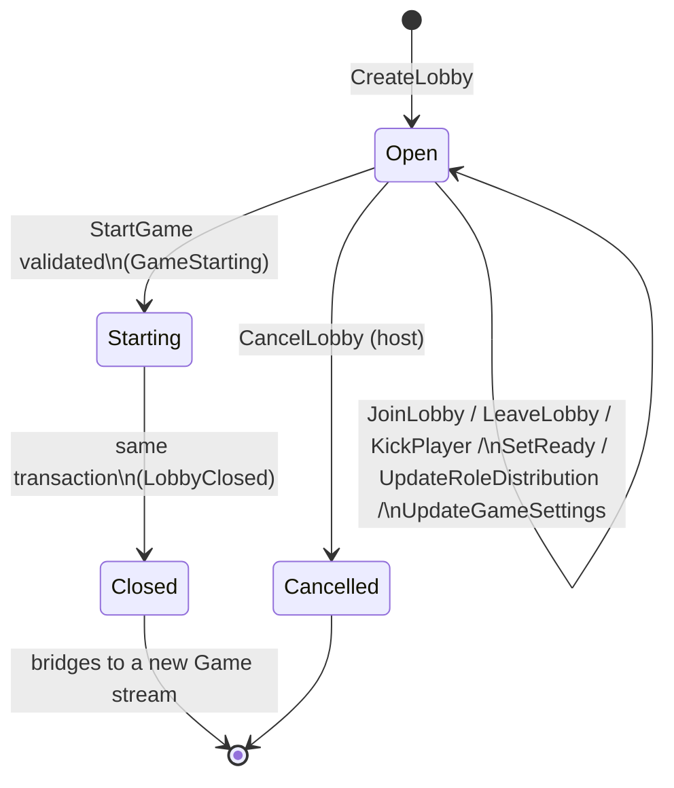
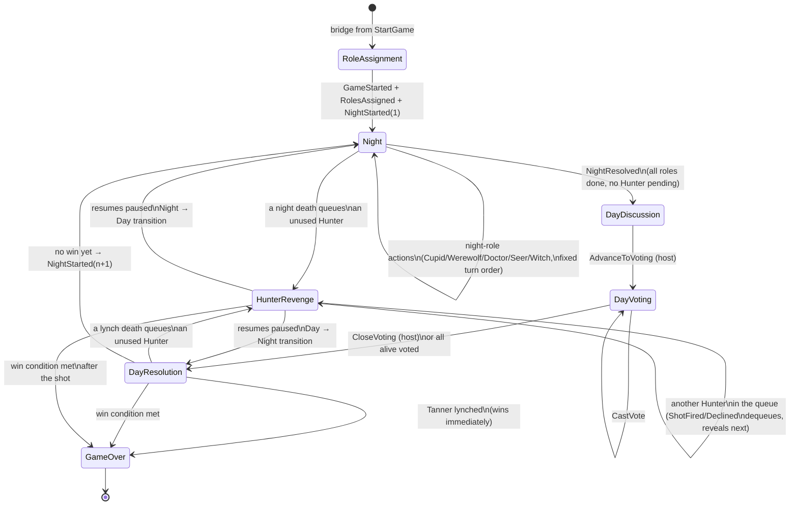
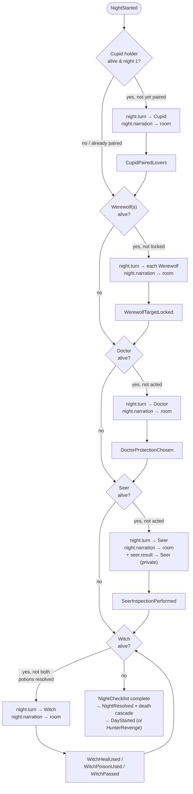
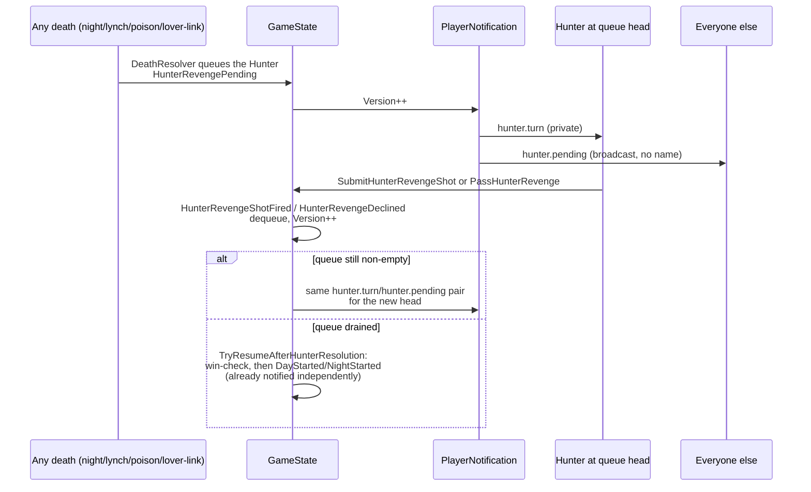

# Werewolf — State & Notification Flow (audited)

This is the verified-correct picture of how `GameState`/`LobbyState` mutate and how SignalR
notifications carry that forward to clients, produced by a full audit of every event's
Apply → notification → `StateVersion` path. It complements `GAME_FLOW.md` (which is the broader
FE integration guide — endpoints, DTOs, screen layouts); this doc is scoped specifically to
*is the state correct, and does every state change actually reach clients*.

## How the resync model works (read this first)

Both aggregates carry a `Version` (`long`), incremented once by every single `Apply` method — one
per event actually folded into the aggregate, so it's a monotonic count that lines up with Marten's
own stream position. Every SignalR notification derived from a `GameState`/`LobbyState` event
carries `StateVersion` set to that aggregate's `Version` at the moment the notification is built.

Clients never treat a notification's payload as authoritative — a notification only means "the
server has something newer than what I have." The client compares `StateVersion` to the last
version it's seen; if it's newer (by one event or by ten — a dropped message and a reconnect are
handled identically), it re-fetches full state from `GET /api/v1/game/{roomCode}` (or
`GET /api/v1/lobby/{roomCode}`) and adopts whatever version that returns. There is no client-side
polling timer — this resync path is the only recovery mechanism.

```mermaid
sequenceDiagram
    participant Actor as Acting player
    participant API as POST endpoint
    participant State as GameState (Marten stream)
    participant Notif as PlayerNotification handler
    participant Hub as SignalR hub
    participant Other as Every other client

    Actor->>API: e.g. POST /api/v1/game/seer/inspect
    API->>State: append SeerInspectionPerformed
    State->>State: Apply(event): mutate fields, Version++
    State-->>Notif: PublishEventsToWolverine forwards the committed event
    Notif->>Notif: build PlayerNotification(s)<br/>StateVersion = state.Version
    Notif->>Hub: private seer.result (Seer only)<br/>+ night.narration (room)<br/>+ night.turn (Witch only)
    Hub->>Other: deliver whichever notifications<br/>this connection is grouped for
    Other->>Other: stateVersion > lastKnownVersion?
    alt newer
        Other->>API: GET /api/v1/game/{roomCode}
        API-->>Other: GameStateResponse (incl. Version)
        Other->>Other: adopt response, lastKnownVersion = Version
    else not newer (stale/duplicate)
        Other->>Other: ignore
    end
```

Reconnect and initial page-load are handled the same way but unconditionally (no version to
compare against yet, or the connection may have missed messages silently while it was down) — both
just call the same `GET` and adopt whatever comes back.

---

## 1. Lobby state machine



Every state-changing Lobby event notifies via a single generic `lobby.updated` kind (clients
always re-fetch full state on receipt — there's no per-field payload to parse). `LobbyCreated` is
the one intentional exception (nobody else is in the room yet to notify). `GameStarting` is folded
into the same transaction as `LobbyClosed` and both now notify — previously `GameStarting` was
silently un-notified and unreflected in the read model, masked only by `LobbyClosed` immediately
following it in the same batch (see Audit log, finding 4).

---

## 2. Game phase state machine



`HunterRevenge` isn't a `GamePhase` value server-side — it's `PendingHunterRevenge` (a queue)
non-empty, orthogonal to whichever phase it interrupted (`Night` or `DayResolution`). `GET` state
reports the underlying phase plus the queue.

---

## 3. Night turn order & notification sequence

Fixed order, strictly enforced server-side: **Cupid (night 1 only) → Werewolves → Doctor → Seer →
Witch**. `NightChecklist.CurrentStep` walks this list, skipping any role nobody living holds.



Every `*Act` box above re-emits `night.turn`/`night.narration` for whichever step comes next (via
the shared `NightTurnNotifications` helper) — **`SeerInspectionPerformed` was the one exception
until this audit**: it only ever sent the private `seer.result` and never called
`NightTurnNotifications`, so nobody (including the Witch, whose turn it now was) learned the night
had advanced past Seer. Fixed by concatenating the same helper every sibling step already calls
(see Audit log, finding 1).

### Hunter revenge (interrupts either Night or DayResolution)



**This entire push was missing until this audit**: `HunterRevengePending`/`ShotFired`/`Declined`
were folded into `GameState` correctly (`Version++` happened) but were never registered in
`PublishEventsToWolverine` and had no `PlayerNotification.Handle` at all — a client only ever
learned "it's now waiting on the Hunter" by re-fetching `GET /api/v1/game/{roomCode}` and noticing
`pendingHunterRevenge` was non-empty, with nothing to prompt that fetch in the first place (see
Audit log, finding 1).

---

## 4. Event → state → notification reference

One row per event. `Version++` — does folding this event increment `GameState`/`LobbyState.Version`.
`Notifies` — what SignalR kind(s), if any, and to whom (**broadcast** = room, **private** = one
player's group).

| Event | Version++ | Notifies |
|---|---|---|
| GameStarted | ✅ | `game.started` broadcast |
| RolesAssigned | ✅ | *(none — roles are private, fetched per-player)* |
| NightStarted | ✅ | `night.started` broadcast + turn-order push |
| CupidPairedLovers | ✅ | turn-order push only |
| WerewolfVoteCast | ✅ | *(none — deliberate; pack coordination pulled via HTTP, see §7 of GAME_FLOW.md)* |
| WerewolfTargetLocked | ✅ | turn-order push only |
| DoctorProtectionChosen | ✅ | turn-order push only |
| SeerInspectionPerformed | ✅ | `seer.result` private **+ turn-order push (fixed by this audit)** |
| WitchHealUsed / WitchPoisonUsed / WitchPassed | ✅ | turn-order push only |
| NightResolved | ✅ | *(none needed — always followed by PlayerDied/DayStarted in the same batch, which do notify)* |
| **HunterRevengePending / ShotFired / Declined** | ✅ | **`hunter.turn` private + `hunter.pending` broadcast (added by this audit — previously nothing)** |
| DayStarted | ✅ | `day.started` broadcast |
| VotingStarted | ✅ | `voting.started` broadcast |
| VoteCast | ✅ | `vote.cast` broadcast (live tally, not just on close) |
| VotingClosed | ✅ | *(none needed — always followed by PlayerLynched/NightStarted)* |
| LynchTargetDetermined | ✅ **(Apply added by this audit — previously silently skipped)** | *(none needed — PlayerLynched follows immediately)* |
| NoLynchOccurred | ✅ **(Apply added by this audit — previously silently skipped)** | *(none needed — NightStarted follows immediately)* |
| PlayerLynched | ✅ | `player.lynched` broadcast |
| PlayerDied | ✅ | `player.died` broadcast (`cause`: `night`/`lynch`/`lover-link`/`hunter-revenge`/`quit`) |
| GameEnded | ✅ | `game.ended` broadcast |
| LobbyCreated | ✅ | *(none — nobody else is in the room yet)* |
| PlayerJoinedLobby / PlayerLeftLobby / PlayerKickedFromLobby / HostTransferred / PlayerReadyStatusChanged / RoleDistributionUpdated / GameSettingsUpdated | ✅ | `lobby.updated` broadcast |
| **GameStarting** | ✅ | **`lobby.updated` broadcast + read-model `Status: Starting` (added by this audit — previously neither happened, masked by the immediately-following LobbyClosed)** |
| LobbyClosed / LobbyCancelled | ✅ | `lobby.updated` broadcast |

---

## 5. Audit log — 2026-07-16

Full trace of every event's Apply/notification/version path, prompted by a report that the game
stalled after the Seer acted. Findings, most severe first:

1. **`SeerInspectionPerformed` never advanced the night turn.** Its notification handler returned
   only the private `seer.result` push, unlike every sibling night-action handler
   (`WerewolfTargetLocked`, `DoctorProtectionChosen`, `CupidPairedLovers`, `WitchHealUsed`,
   `WitchPoisonUsed`, `WitchPassed`), which all call the shared `NightTurnNotifications` helper.
   Result: after the Seer acted, nobody — including the Witch, whose turn it now was — ever learned
   the night had advanced. **Fixed**: concatenate `NightTurnNotifications(state)` onto the Seer
   handler's return, matching its siblings.
2. **Hunter-revenge turn was completely invisible over SignalR.** `HunterRevengePending`/
   `ShotFired`/`Declined` folded into `GameState` correctly but were never registered in
   `PublishEventsToWolverine` and had no notification handler at all — worse than finding 1, since
   there was no push whatsoever, not even a stale one. **Fixed**: registered all three events for
   publishing and added a handler that pushes `hunter.turn` (private, to the queue head) +
   `hunter.pending` (broadcast) whenever the queue's head could have changed.
3. **Doctor/Seer "done" tracking is a single per-night flag, not per-player**, while nothing capped
   the lobby's role distribution from assigning more than one Doctor/Seer/Witch/Hunter/Cupid/Tanner.
   A second holder of any of these would be silently locked out of their own turn once the first
   holder acted. **Fixed**: `LobbyCommandSupport.ValidateRoleDistribution` now rejects a
   distribution assigning more than one of these six unique-in-the-classic-game roles, rather than
   reworking `GameState`'s tracking to be per-player for a configuration no real game wants.
4. **`RoomLobbyView` (the lobby read model) never reflected or notified `GameStarting`.** Masked in
   practice because `StartGameEndpoint` always appends `GameStarting` immediately followed by
   `LobbyClosed` in the same batch, so the very next event still notified with a version covering
   both — but a latent gap regardless. **Fixed**: added `Apply(GameStarting)` (`Status: Starting`)
   and included it in the notify switch, for consistency and to remove the ordering dependency.
5. **`LynchTargetDetermined` and `NoLynchOccurred` had no `Apply` method in `GameState` at all** —
   Marten's `LiveStreamAggregation` silently skips folding event types with no matching `Apply`, so
   `Version` didn't count them, under-counting relative to Marten's true stream length until the
   next event folded. Harmless today (nothing reads their fields back, and no notification's
   `StateVersion` depended on catching them specifically), but broke the "every event increments
   Version exactly once" contract every other event honors. **Fixed**: added no-op
   `Apply` overloads for both, incrementing `Version` only.

**Verified correct, no action needed:**
- Every `PlayerNotification.Broadcast`/`ToPlayer` call for a `GameState`-derived event passes
  `stateVersion: state.Version` — no gaps found.
- `NotifyRoomUpdated`/lobby notifications correctly source their version from Marten's own
  `IEvent.Version` in `RoomLobbyViewProjection.RaiseSideEffects`, and this numerically agrees with
  `LobbyState.Version` because both projections fold every Lobby event type in the same order.
- Frontend `WerewolfNotification` kind strings and payload shapes match the backend exactly (no
  casing or field-name mismatches).
- `WerewolfVoteCast` and Cupid's pairing being un-pushed over SignalR are deliberate (privacy —
  see `GAME_FLOW.md` §7), not gaps.
